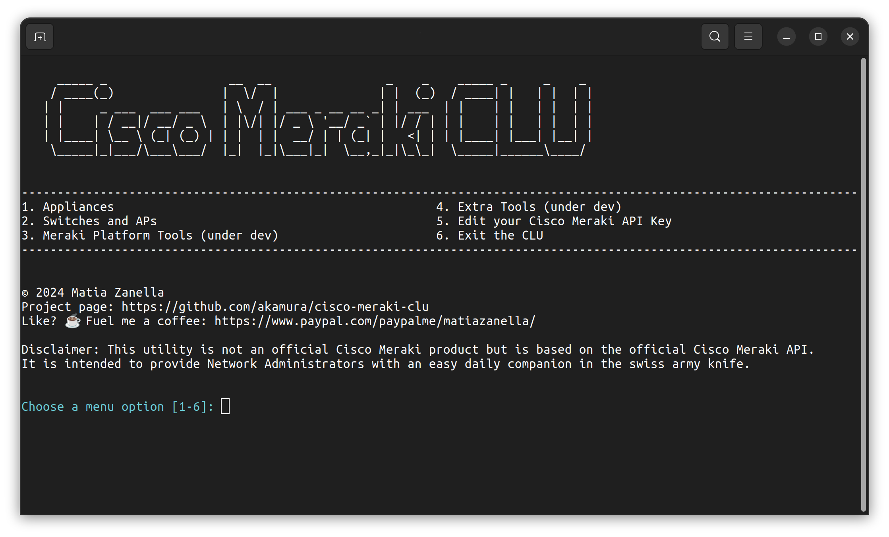

# Cisco Meraki Command Line Utility


**Cisco Meraki CLU** (Command Line Utility) is an essential tool crafted for Network Administrators managing Cisco Meraki networks. It streamlines and accelerates your workflow, offering quick access to vital information—especially crucial during intensive troubleshooting sessions where time is of the essence and web dashboard accessibility is limited.


<br><br>
# 🌟 Features

- **API Key Management**: Securely 256-bit AES store and effortlessly manage your Cisco Meraki API key in an encrypted local DB.
- **Device Listing**: Instantly retrieve detailed lists of APs and switches.
- **Meraki MX Status Monitoring**: Keep a pulse on the status of your Meraki MX appliances. (under development)
- **Organization & Network Management**: Efficiently navigate through organizations and networks. (under development)
- **Data Export**: Conveniently export device data into well-organized CSV files.
- **Network Diagnostics Toolkit**: Includes additional third-party open-source tools troubleshoot network issues. (under development)

<br><br>
# 🚀 Installation

## Required dependencies
    - Python 3.x
    - Required Python Packages:
        - pysqlcipher3
        - tabulate
        - getpass
        - pathlib
        - datetime
        - termcolor
        - rich

## Clone the repository
```shell
    git clone https://github.com/akamura/cisco-meraki-clu.git
```
## Install the required packages
```shell
    pip install -r /opt/akamura/ciscomerakiclu/requirements.txt
```
or
```shell
    sudo pip install tabulate pathlib datetime termcolor pysqlcipher3 rich requests --break-system-packages
```

Please note that when you execute **main.py** it will search for additional modules and autoinstall it with pip based on modules references.


## 🐧 DEB Install from a Release
At the moment I released the program for Ubuntu and tested under OS release 22.04.3 LTS.
Download the release and execute.
```shell
    sudo apt install ./cisco-meraki-clu.deb
```

## 🐧 DEB Uninstall from a Release
If you want to uninstall the Ubuntu .deb release execute this command
```shell
    sudo apt remove ciscomerakiclu
```

## 🍎 MacOS Install from Source
I'm working on releasing the a DMG on next version update, meanwhile you can use the source code.
```shell
    /bin/bash -c "$(curl -fsSL https://raw.githubusercontent.com/Homebrew/install/HEAD/install.sh)"
```
```shell
    brew install python3 pipx sqlite sqlcipher
```
```shell
    /Library/Developer/CommandLineTools/usr/bin/python3 -m pip install --upgrade pip
```
```shell
    pip3 install pysqlcipher3 --no-build-isolation
```
```shell
    pip install tabulate getpass pathlib datetime termcolor rich requests
```
Assuming that you downloaded and unzipped the source code:
```shell
    sudo mv ~/Downloads/cisco-meraki-clu-main/opt/akamura /opt
```

Run the application from the Terminal with this command
```shell
    python3 /opt/akamura/ciscomerakiclu/main.py
```


<br><br>
# 🎬 Getting Started

**Step 1: Retrieve your Cisco Meraki API Key**
   - Before you begin, make sure you have Cisco Meraki API key.
   - You can retrieve it from your Cisco Meraki Dashboard, for this you can refer to the [Cisco Meraki Dashboard API](https://documentation.meraki.com/General_Administration/Other_Topics/Cisco_Meraki_Dashboard_API) Knowledge Base.

**Step 2: Store the key in the Encrypted AES-256 DB**
   - When you run the program for the first time it will ask you to create the DB.
   - Create the DB and then select option 5 from the Main Menu called **Set your Cisco Meraki API Key**
   - Paste your Cisco Meraki API key and press enter. The key will be stored securely and can be edited by selecting option 5 again. For security reasons there will be no option to show the Cisco Meraki API key after this have been saved.

**Step 3: Use the program**
   - Your key is stored and are ready to go.


<br><br>
# 👐 Contributing
Your contributions make this project thrive. Feel free to report issues, suggest features, or submit pull requests.
Every bit of help is valued!


<br><br>
# 💖 Acknowledgments
Cisco Systems Inc. to provide such robust API, you can find more [here](https://developer.cisco.com/meraki/).

Open-Source Community: For the valuable libraries that enhance this project.

<br><br>
# 📬 Contact
Got questions or suggestions? Join the conversation on the [Discussions panel](https://github.com/akamura/cisco-meraki-clu/discussions).

Let's make Network Management seamless with Cisco Meraki CLU! 🚀