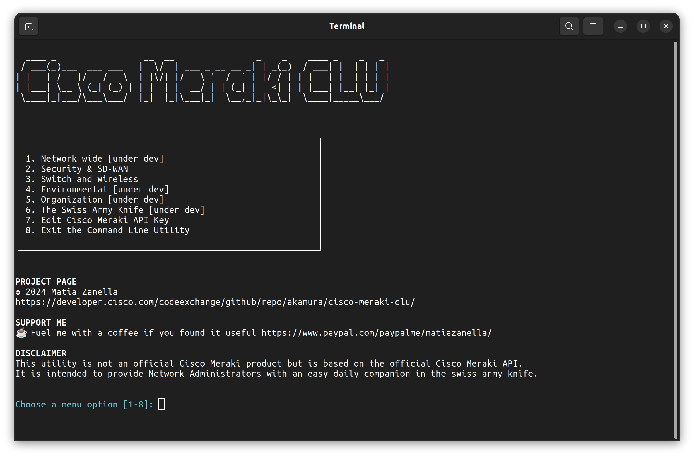

# Cisco Meraki Command Line Utility


**Cisco Meraki CLU** (Command Line Utility) is an essential tool crafted for Network Administrators managing Cisco Meraki networks. It streamlines and accelerates your workflow, offering quick access to vital information—especially crucial during intensive troubleshooting sessions where time is of the essence and web dashboard accessibility is limited.


[](https://developer.cisco.com/codeexchange/github/repo/akamura/cisco-meraki-clu) [](https://developer.cisco.com/codeexchange/devenv/akamura/cisco-meraki-clu/)

<br><br>
# 🌟 Features

- **API Key Management**: Securely 256-bit AES store and effortlessly manage your Cisco Meraki API key in an encrypted local DB.
- **Device Listing**: Instantly retrieve detailed lists of APs and switches.
- **Meraki MX Status Monitoring**: Keep a pulse on the status of your Meraki MX appliances. (under development)
- **Organization & Network Management**: Efficiently navigate through organizations and networks. (under development)
- **Data Export**: Conveniently export device data into well-organized CSV files.
- **Network Diagnostics Toolkit**: Includes additional third-party open-source tools troubleshoot network issues. (under development)

<br><br>
# 🚀 Installation guide for Linux and MacOS

## Optimal Experience

To achieve the optimal experience, I highly encourage you to download and install my specially crafted terminal profile. This profile has been meticulously tailored, with a focus on color customization, to ensure a perfect blend of aesthetic appeal and functional excellence.

[Download and Install Terminal Profile](https://github.com/akamura/terminal-profile/)

## Required packages and dependencies
    - Python 3.x
    - pip
    - sqlite
    - sqlcipher
    - build-essential
    - libsqlcipher-dev
    - libsqlite3-dev

    - Required Python Packages:
        - tabulate
        - pathlib
        - datetime
        - termcolor
        - pysqlcipher3
        - rich
        - setuptools
        - dnspython
        - ipinfo
        - scapy
        - secrets
        - numpy
        - ipaddress

## IPinfo.io Token
The Swiss Army Knife tools include the powerful **IP Check** utility that run with IPinfo API, to use the utility you need to generate and save the API token.
You can SignUP for free at [IPinfo.io](https://ipinfo.io/) and from your Dashboard get the **Token**.
When you run the Cisco Meraki CLU choose the menu option **Set IPinfo Token** and paste your API token.

## Clone the repository
```shell
    git clone https://github.com/akamura/cisco-meraki-clu.git
```
## Install the required packages
```shell
    pip install -r /opt/akamura/ciscomerakiclu/requirements.txt
```
Please note that when you execute **main.py** it will search for additional modules and autoinstall it with pip based on modules references.


## 🐧 DEB Install from a Release
At the moment I released the program for Ubuntu and tested under OS release 22.04.3 LTS.
Download the release and execute.
```shell
    sudo apt install ./cisco-meraki-clu.deb
```

## 🐧 DEB Uninstall from a Release
If you want to uninstall the Ubuntu .deb release execute this command
```shell
    sudo apt remove ciscomerakiclu
```

## 🍎 macOS Install from Source
I'm working on releasing the a DMG on next version update, meanwhile you can use the source code.
```shell
    /bin/bash -c "$(curl -fsSL https://raw.githubusercontent.com/Homebrew/install/HEAD/install.sh)"
```
```shell
    brew install python3 pipx sqlite sqlcipher
```
```shell
    /Library/Developer/CommandLineTools/usr/bin/python3 -m pip install --upgrade pip
```
```shell
    pip3 install pysqlcipher3 --no-build-isolation
```
```shell
    pip install tabulate getpass pathlib datetime termcolor rich requests
```
Assuming that you downloaded and unzipped the source code:
```shell
    sudo mv ~/Downloads/cisco-meraki-clu-main/opt/akamura /opt
```

Run the application from the Terminal with this command
```shell
    python3 /opt/akamura/ciscomerakiclu/main.py
```


<br><br>
# 🚀 Installation guide for Microsoft Windows

## Download the repository
On top right corner of the GitHub page click **Code** than **Download ZIP**.
Extract the **WINDOWS** directory from the **Source code** ZIP content in your Downloads folder.

## Install
Run Windows PowerShell as Administrator

```shell
    PS C:\Users\akamura> Set-ExecutionPolicy Unrestricted #answer YES or ALL
    PS C:\Users\akamura> cd $env:USERPROFILE\Downloads\WINDOWS\
    PS C:\Users\akamura> .\setup.ps1 #hit enter
    PS C:\Users\akamura> exit
```

## Required packages and dependencies
Visit [Python Website](https://www.python.org/) to download and install the latest Python 3.x
 
- On installation wizard **Optional features** choose to **install pip**.
- On installation wizard choose **Associate files with Python**, **Add Python to environment variables** and **Precompile standard library**.

If the installation was successful, open Microsoft Command Promt (CMD) and type the following command. You should see something like this:

```shell
    C:\Users\akamura>python --version
    Python 3.12.2
```

Proceed further to install the required packages, from Microsoft Command Promt (CMD) run this:

```shell
    cd C:\Users\YourUsername\Utilities\akamura\ciscomerakiclu
    pip install -r requirements.txt
```

Please note that when you execute **main.py** it will search for additional modules and autoinstall it with pip based on modules references.


<br><br>
# 🎬 Getting Started

**Step 1: Retrieve your Cisco Meraki API Key**
   - Before you begin, make sure you have your Cisco Meraki API key.
   - You can retrieve it from your Cisco Meraki Dashboard, for this you can refer to the [Cisco Meraki Dashboard API](https://documentation.meraki.com/General_Administration/Other_Topics/Cisco_Meraki_Dashboard_API) Knowledge Base.

**Step 2: Store the key in the Cisco Meraki CLU Encrypted Database**
   - When you run the program for the first time it will ask you to create the Database and protect with a password. Use a strong password since you will need it each time you run the program.
   - Create the Database and then select the menu option called **Set your Cisco Meraki API Key**
   - Paste your Cisco Meraki API key and press enter. The key will be stored securely and can be edited again later. For security reasons there will be no option to show the Cisco Meraki API key after this have been saved.

**Step 3: Use the program**
   - Your key is stored and you are ready to go.
   - Browse the option to use the program.


<br><br>
# 👐 Contributing
This is not just a project; it's a community effort. I'm inviting you to be a part of this journey. Star it, fork it, contribute, or just play around with it. Every feedback, issue, or pull request is an opportunity for us to make this tool even more amazing. 


<br><br>
# 💖 Acknowledgments
Cisco Systems Inc. to provide such robust API, you can find more [here](https://developer.cisco.com/meraki/).

Open-Source Community: For the valuable libraries that enhance this project.

<br><br>
# 📬 Contact
Got questions or suggestions? Join the conversation on the [Discussions panel](https://github.com/akamura/cisco-meraki-clu/discussions).

Let's make Network Management seamless with Cisco Meraki CLU! 🚀
